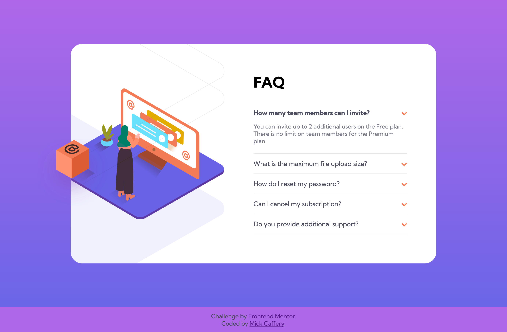

# Frontend Mentor - FAQ accordion card solution

This is a solution to the [FAQ accordion card challenge on Frontend Mentor](https://www.frontendmentor.io/challenges/faq-accordion-card-XlyjD0Oam). Frontend Mentor challenges help you improve your coding skills by building realistic projects. 

## Table of contents

- [Frontend Mentor - FAQ accordion card solution](#frontend-mentor---faq-accordion-card-solution)
  - [Table of contents](#table-of-contents)
  - [Overview](#overview)
    - [The challenge](#the-challenge)
    - [Screenshots](#screenshots)
    - [Links](#links)
  - [My process](#my-process)
    - [Built with](#built-with)
    - [What I learned](#what-i-learned)
    - [Continued development](#continued-development)
    - [Useful resources](#useful-resources)
  - [Author](#author)

## Overview

### The challenge

Users should be able to:

- View the optimal layout for the component depending on their device's screen size
- See hover states for all interactive elements on the page
- Hide/Show the answer to a question when the question is clicked

### Screenshots

Desktop View

Mobile View

### Links

- Solution URL: [https://www.frontendmentor.io/challenges/faq-accordion-card-XlyjD0Oam](https://www.frontendmentor.io/challenges/faq-accordion-card-XlyjD0Oam)
- Live Site URL: [https://preeminent-biscochitos-2ced7e.netlify.app/](https://preeminent-biscochitos-2ced7e.netlify.app/)

## My process

### Built with

- HTML5 markup
- CSS custom properties
- Flexbox
- Mobile-first workflow
- JavaScript

### What I learned

My main learnings were:

CSS
- Background gradients.
- Positioning multiple background images.

JavaScript
- Implementing the accordion drop-down feature.

### Continued development

- Continue to build different front-end components using JavaScript
- In the next few weeks, I'll start to learn React.
- Then I plan to learn Express.js and Node.js

### Useful resources

- [https://www.w3schools.com/howto/tryit.asp?filename=tryhow_js_accordion_animate](https://www.w3schools.com/howto/tryit.asp?filename=tryhow_js_accordion_animate) - I found this example helpful in learning how to use javascript to create the accordion feature

## Author

- GitHub - [Mick Caffery](https://github.com/mickcaff)
- Frontend Mentor - [@mickcaff](https://www.frontendmentor.io/profile/mickcaff)
- [LinkedIn](https://www.linkedin.com/in/mcaffery/)

